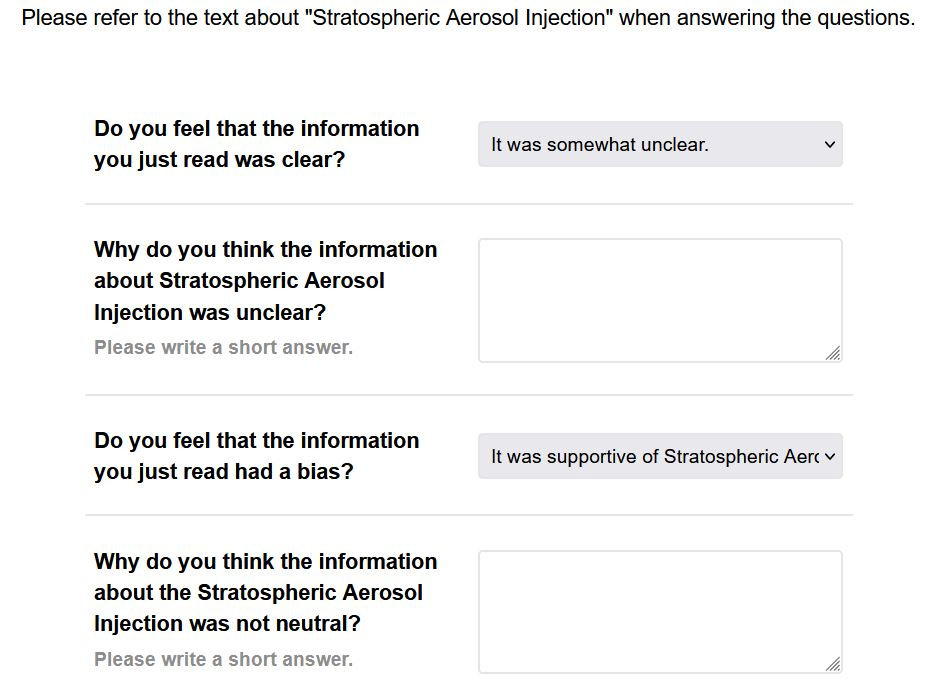
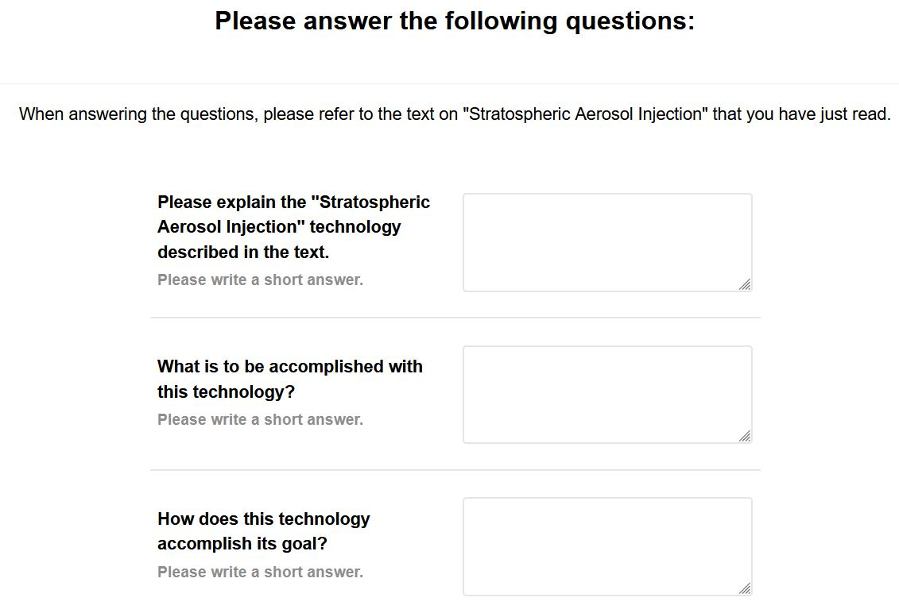
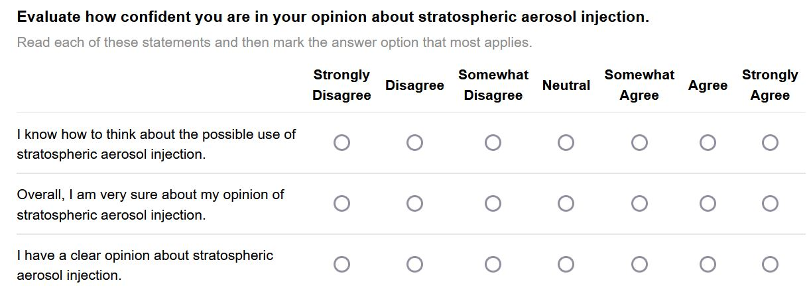
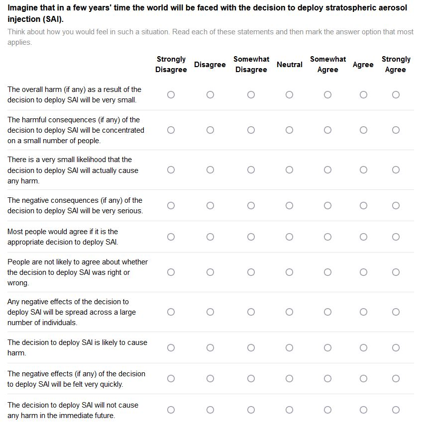
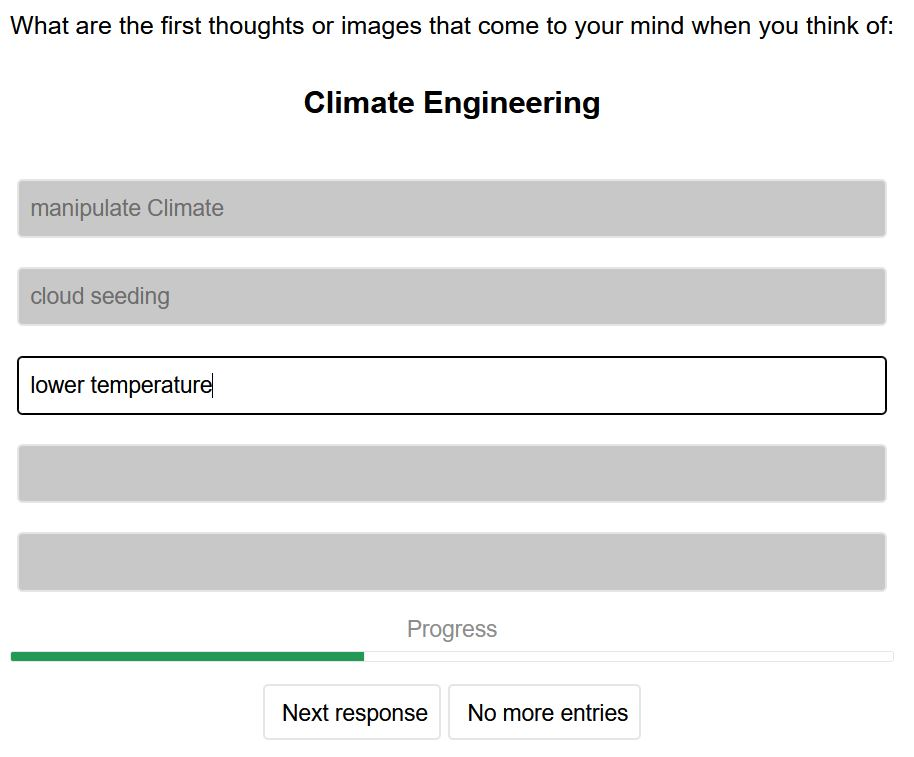
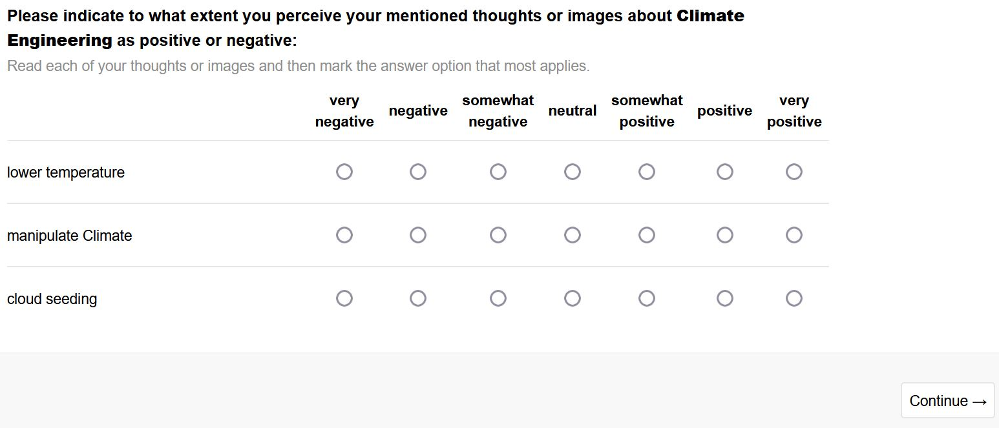

```{css, echo=FALSE}
.CSSoutput {
  background-color: lightgrey;
  border: 1px solid black;
}
```
```{r setup chunks, include=FALSE}
knitr::opts_chunk$set(class.source = "CSSoutput",
                      eval = TRUE, echo = FALSE, include = TRUE,      
                      fig.align='center', fig.show='asis',
                      size='footnotesize')

```


```{r setup, include=FALSE}
# reset R environment
rm(list=ls(all=TRUE))
graphics.off()

################
# install and load packages
################
#  if packages are not already installed, the function will install and activate them
usePackage <- function(p) {
  if (!is.element(p, installed.packages()[,1]))
    install.packages(p, dep = TRUE, repos = "http://cran.us.r-project.org")
  require(p, character.only = TRUE)
}

usePackage("tidyverse") # data cleaning and summarizing
usePackage("psych") # psychometric analysis (EFA)
usePackage("jsonlite") 
usePackage("magrittr") 
usePackage("xlsx") 

usePackage("stargazer") # create tables
usePackage("Cairo")
rm(usePackage)
```


```{r functions, include=FALSE}
# dataset = dat_NanoPat
# listvars = ques_mixed
# notNumeric = vec_notNumeric
questionnairetype <- function(dataset,
                              listvars = ques_mixed,
                              notNumeric = vec_notNumeric){

  datasetques <- data.frame(ID = unique(dataset$ID))

  for(c in 1:length(listvars)){
    if(any(colnames(dataset) == listvars[c])){
      # print(c)
      ## tmp IDs
      tmpid <- dataset$ID[!is.na(dataset[, listvars[c]])]
      ## tmp value variable
      tmpvalue <- dataset[, listvars[c]][!is.na(dataset[, listvars[c]])]
      datasetques[listvars[c]]  <- NA

      if(listvars[c] %in% notNumeric){
        datasetques[datasetques$ID %in% tmpid, listvars[c]] <- tmpvalue
      }else{
        datasetques[datasetques$ID %in% tmpid, listvars[c]] <- as.numeric(tmpvalue)
      }
    }
  }
  return(datasetques)
}
```

```{r loaddata, include=FALSE}
#### remove all dataset with less than X percent
sel_per <- 90 # keep datasets with more than 90%

#### load SAI descriptive ####
read_file('data/jatos_results_preTest_SAIdescriptive.txt') %>%
  # ... split it into lines ...
  str_split('\n') %>% first() %>%
  # ... filter empty rows ...
  discard(function(x) x == '') %>%
  # ... parse JSON into a data.frame
  map_dfr(fromJSON, flatten=TRUE) -> dat_SAIdes

# ID variable dat_SAIdes
dat_SAIdes$ID <- NA
tmp_IDcounter <- 0
for(i in 1:nrow(dat_SAIdes)){
  if(!is.na(dat_SAIdes$url.srid[i])){
    # tmp <- dat_SAIdes$prolific_pid[i]
    tmp_IDcounter = tmp_IDcounter + 1
  }
  dat_SAIdes$ID[i] <- tmp_IDcounter
}


# remove
tmp_sel <- data.frame(ID = unique(dat_SAIdes$ID),
                      solved_perc = as.numeric(table(dat_SAIdes$ID) / max(table(dat_SAIdes$ID)) * 100))
# tmp_sel[tmp_sel$solved_perc <= sel_per, ]
tmp_sel <- tmp_sel[tmp_sel$solved_perc > sel_per, ]
dat_SAIdes <- dat_SAIdes[dat_SAIdes$ID %in% tmp_sel$ID,]


# get dataset
ques_mixed <- c("PROLIFIC_PID",
                "dummy_informedconsent",
                str_subset(string = colnames(dat_SAIdes), pattern = "^R"),
                str_subset(string = colnames(dat_SAIdes), pattern = "^affImg"),
                "knowSRM", "knowSRMdefinition",
                str_subset(string = colnames(dat_SAIdes), pattern = "^undSAI"),
                "clearSAI", "clearSAItext",
                "biasSAI", "biasSAItext",
                str_subset(string = colnames(dat_SAIdes), pattern = "^certaintySAI"),
                str_subset(string = colnames(dat_SAIdes), pattern = "^MoralIntensity"))
vec_notNumeric = c("PROLIFIC_PID", str_subset(string = colnames(dat_SAIdes), pattern = "^R"),
                   "knowSRMdefinition", "clearSAItext", "biasSAItext", "knowSRM",
                   str_subset(string = colnames(dat_SAIdes), pattern = "^undSAI"))

questionnaire_SAIdes <- questionnairetype(dataset = dat_SAIdes, 
                                   listvars = ques_mixed, 
                                   notNumeric = vec_notNumeric)

# grouping variable
questionnaire_SAIdes$group <- "SAIdes"

questionnaire_SAIdes$knowSRM <- ifelse(test = questionnaire_SAIdes$knowSRM == "knowSRMno", yes = 0,
                                no = ifelse(test = questionnaire_SAIdes$knowSRM == "knowSRMlittle", yes = 1,
                                              no = ifelse(test = questionnaire_SAIdes$knowSRM == "knowSRMlot", yes = 2,
                                                          no = "ERROR")))

questionnaire_SAIdes$biasSAI <- ifelse(test = questionnaire_SAIdes$biasSAI == 3, yes = "supportive",
                                no = ifelse(test = questionnaire_SAIdes$biasSAI == 2, yes = "neutral",
                                              no = ifelse(test = questionnaire_SAIdes$biasSAI == 1, yes = "opposed",
                                                          no = "ERROR")))
questionnaire_SAIdes$clearSAI <- ifelse(test = questionnaire_SAIdes$clearSAI == 4, yes = "clear++",
                                no = ifelse(test = questionnaire_SAIdes$clearSAI == 3, yes = "clear+",
                                              no = ifelse(test = questionnaire_SAIdes$clearSAI == 2, yes = "-unclear", no = ifelse(test = questionnaire_SAIdes$clearSAI == 1, yes = "--unclear",
                                                          no = "ERROR"))))

#### load SAI narrativ #### 
read_file('data/jatos_results_preTest_SAInarrativ.txt') %>%
  # ... split it into lines ...
  str_split('\n') %>% first() %>%
  # ... filter empty rows ...
  discard(function(x) x == '') %>%
  # ... parse JSON into a data.frame
  map_dfr(fromJSON, flatten=TRUE) -> dat_SAInar

# ID variable dat_SAInar
dat_SAInar$ID <- NA
tmp_IDcounter <- 0
for(i in 1:nrow(dat_SAInar)){
  if(!is.na(dat_SAInar$url.srid[i])){
    # tmp <- dat_SAInar$prolific_pid[i]
    tmp_IDcounter = tmp_IDcounter + 1
  }
  dat_SAInar$ID[i] <- tmp_IDcounter
}


# remove
tmp_sel <- data.frame(ID = unique(dat_SAInar$ID),
                      solved_perc = as.numeric(table(dat_SAInar$ID) / max(table(dat_SAInar$ID)) * 100))
# tmp_sel[tmp_sel$solved_perc <= sel_per, ]
tmp_sel <- tmp_sel[tmp_sel$solved_perc > sel_per, ]
dat_SAInar <- dat_SAInar[dat_SAInar$ID %in% tmp_sel$ID,]


# get dataset
ques_mixed <- c("PROLIFIC_PID",
                "dummy_informedconsent",
                str_subset(string = colnames(dat_SAInar), pattern = "^R"),
                str_subset(string = colnames(dat_SAInar), pattern = "^affImg"),
                "knowSRM", "knowSRMdefinition",
                str_subset(string = colnames(dat_SAInar), pattern = "^undSAI"),
                "clearSAI", "clearSAItext",
                "biasSAI", "biasSAItext",
                str_subset(string = colnames(dat_SAInar), pattern = "^certaintySAI"),
                str_subset(string = colnames(dat_SAInar), pattern = "^MoralIntensity"))
vec_notNumeric = c("PROLIFIC_PID", str_subset(string = colnames(dat_SAInar), pattern = "^R"),
                   "knowSRMdefinition", "clearSAItext", "biasSAItext", "knowSRM",
                   str_subset(string = colnames(dat_SAInar), pattern = "^undSAI"))

questionnaire_SAInar <- questionnairetype(dataset = dat_SAInar, 
                                   listvars = ques_mixed, 
                                   notNumeric = vec_notNumeric)

# grouping variable
questionnaire_SAInar$group <- "SAInar"

questionnaire_SAInar$knowSRM <- ifelse(test = questionnaire_SAInar$knowSRM == "knowSRMno", yes = 0,
                                no = ifelse(test = questionnaire_SAInar$knowSRM == "knowSRMlittle", yes = 1,
                                              no = ifelse(test = questionnaire_SAInar$knowSRM == "knowSRMlot", yes = 2,
                                                          no = "ERROR")))

questionnaire_SAInar$biasSAI <- ifelse(test = questionnaire_SAInar$biasSAI == 3, yes = "supportive",
                                no = ifelse(test = questionnaire_SAInar$biasSAI == 2, yes = "neutral",
                                              no = ifelse(test = questionnaire_SAInar$biasSAI == 1, yes = "opposed",
                                                          no = "ERROR")))
questionnaire_SAInar$clearSAI <- ifelse(test = questionnaire_SAInar$clearSAI == 4, yes = "clear++",
                                no = ifelse(test = questionnaire_SAInar$clearSAI == 3, yes = "clear+",
                                              no = ifelse(test = questionnaire_SAInar$clearSAI == 2, yes = "-unclear", no = ifelse(test = questionnaire_SAInar$clearSAI == 1, yes = "--unclear",
                                                          no = "ERROR"))))


#### load Nano Pat #### 
read_file('data/jatos_results_preTest_NanoPat.txt') %>%
  # ... split it into lines ...
  str_split('\n') %>% first() %>%
  # ... filter empty rows ...
  discard(function(x) x == '') %>%
  # ... parse JSON into a data.frame
  map_dfr(fromJSON, flatten=TRUE) -> dat_NanoPat

# ID variable dat_NanoPat
dat_NanoPat$ID <- NA
tmp_IDcounter <- 0
for(i in 1:nrow(dat_NanoPat)){
  if(!is.na(dat_NanoPat$url.srid[i])){
    # tmp <- dat_NanoPat$prolific_pid[i]
    tmp_IDcounter = tmp_IDcounter + 1
  }
  dat_NanoPat$ID[i] <- tmp_IDcounter
}


# remove
tmp_sel <- data.frame(ID = unique(dat_NanoPat$ID),
                      solved_perc = as.numeric(table(dat_NanoPat$ID) / max(table(dat_NanoPat$ID)) * 100))
# tmp_sel[tmp_sel$solved_perc <= sel_per, ]
tmp_sel <- tmp_sel[tmp_sel$solved_perc > sel_per, ]
dat_NanoPat <- dat_NanoPat[dat_NanoPat$ID %in% tmp_sel$ID,]


# get dataset
ques_mixed <- c("PROLIFIC_PID",
                "dummy_informedconsent",
                str_subset(string = colnames(dat_NanoPat), pattern = "^affImg"),
                str_subset(string = colnames(dat_NanoPat), pattern = "^undSAI"),
                "clearSAI", "clearSAItext",
                "biasSAI", "biasSAItext",
                str_subset(string = colnames(dat_NanoPat), pattern = "^certaintySAI"),
                str_subset(string = colnames(dat_NanoPat), pattern = "^MoralIntensity"))
vec_notNumeric = c("PROLIFIC_PID", "clearSAItext", "biasSAItext",
                   str_subset(string = colnames(dat_NanoPat), pattern = "^undSAI"))

questionnaire_NanoPat <- questionnairetype(dataset = dat_NanoPat, 
                                   listvars = ques_mixed, 
                                   notNumeric = vec_notNumeric)

questionnaire_NanoPat$biasSAI <- ifelse(test = questionnaire_NanoPat$biasSAI == 3, yes = "supportive",
                                no = ifelse(test = questionnaire_NanoPat$biasSAI == 2, yes = "neutral",
                                              no = ifelse(test = questionnaire_NanoPat$biasSAI == 1, yes = "opposed",
                                                          no = "ERROR")))
questionnaire_NanoPat$clearSAI <- ifelse(test = questionnaire_NanoPat$clearSAI == 4, yes = "clear++",
                                no = ifelse(test = questionnaire_NanoPat$clearSAI == 3, yes = "clear+",
                                              no = ifelse(test = questionnaire_NanoPat$clearSAI == 2, yes = "-unclear", no = ifelse(test = questionnaire_NanoPat$clearSAI == 1, yes = "--unclear",
                                                          no = "ERROR"))))

# grouping variable
questionnaire_NanoPat$group <- "NanoPAT"

## add columns for the word association game
questionnaire_NanoPat$NanoR1 <- NA
questionnaire_NanoPat$NanoR2 <- NA
questionnaire_NanoPat$NanoR3 <- NA
questionnaire_NanoPat$NanoR4 <- NA
questionnaire_NanoPat$NanoR5 <- NA
questionnaire_NanoPat$MSR1 <- NA
questionnaire_NanoPat$MSR2 <- NA
questionnaire_NanoPat$MSR3 <- NA
questionnaire_NanoPat$MSR4 <- NA
questionnaire_NanoPat$MSR5 <- NA

for(i in 1:nrow(questionnaire_NanoPat)){
  tmpID <- questionnaire_NanoPat$ID[i]
  
  tmpNano <- questionnaire_NanoPat[questionnaire_NanoPat$ID == tmpID,str_subset(string = colnames(questionnaire_NanoPat), pattern = "affImgAffectNano")]
  tmpNano <- tmpNano[!is.na(tmpNano)]
  
    tmpMS <- questionnaire_NanoPat[questionnaire_NanoPat$ID == tmpID,str_subset(string = colnames(questionnaire_NanoPat), pattern = "affImgAffectMS")]
  tmpMS <- tmpMS[!is.na(tmpMS)]
  
  tmpDat <- dat_NanoPat[dat_NanoPat$ID == tmpID,str_subset(string = colnames(dat_NanoPat), pattern = "^R")]
  
  
  questionnaire_NanoPat[questionnaire_NanoPat$ID == tmpID, str_subset(string = colnames(questionnaire_NanoPat), pattern = "^NanoR")] <- tmpDat[7,]
    questionnaire_NanoPat[questionnaire_NanoPat$ID == tmpID, str_subset(string = colnames(questionnaire_NanoPat), pattern = "^MSR")] <- tmpDat[9,]
}


#### load Social Robots #### 
read_file('data/jatos_results_preTest_SocialRobots.txt') %>%
  # ... split it into lines ...
  str_split('\n') %>% first() %>%
  # ... filter empty rows ...
  discard(function(x) x == '') %>%
  # ... parse JSON into a data.frame
  map_dfr(fromJSON, flatten=TRUE) -> dat_SocialRobots

# ID variable dat_SocialRobots
dat_SocialRobots$ID <- NA
tmp_IDcounter <- 0
for(i in 1:nrow(dat_SocialRobots)){
  if(!is.na(dat_SocialRobots$url.srid[i])){
    # tmp <- dat_SocialRobots$prolific_pid[i]
    tmp_IDcounter = tmp_IDcounter + 1
  }
  dat_SocialRobots$ID[i] <- tmp_IDcounter
}


# remove
tmp_sel <- data.frame(ID = unique(dat_SocialRobots$ID),
                      solved_perc = as.numeric(table(dat_SocialRobots$ID) / max(table(dat_SocialRobots$ID)) * 100))
# tmp_sel[tmp_sel$solved_perc <= sel_per, ]
tmp_sel <- tmp_sel[tmp_sel$solved_perc > sel_per, ]
dat_SocialRobots <- dat_SocialRobots[dat_SocialRobots$ID %in% tmp_sel$ID,]


# get dataset
ques_mixed <- c("PROLIFIC_PID",
                "dummy_informedconsent",
                str_subset(string = colnames(dat_SocialRobots), pattern = "^affImg"),
                str_subset(string = colnames(dat_SocialRobots), pattern = "^undSAI"),
                "clearSAI", "clearSAItext",
                "biasSAI", "biasSAItext",
                str_subset(string = colnames(dat_SocialRobots), pattern = "^certaintySAI"),
                str_subset(string = colnames(dat_SocialRobots), pattern = "^MoralIntensity"))
vec_notNumeric = c("PROLIFIC_PID", "clearSAItext", "biasSAItext",
                   str_subset(string = colnames(dat_SocialRobots), pattern = "^undSAI"))

questionnaire_SocialRobots <- questionnairetype(dataset = dat_SocialRobots, 
                                   listvars = ques_mixed, 
                                   notNumeric = vec_notNumeric)

questionnaire_SocialRobots$biasSAI <- ifelse(test = questionnaire_SocialRobots$biasSAI == 3, yes = "supportive",
                                no = ifelse(test = questionnaire_SocialRobots$biasSAI == 2, yes = "neutral",
                                              no = ifelse(test = questionnaire_SocialRobots$biasSAI == 1, yes = "opposed",
                                                          no = "ERROR")))
questionnaire_SocialRobots$clearSAI <- ifelse(test = questionnaire_SocialRobots$clearSAI == 4, yes = "clear++",
                                no = ifelse(test = questionnaire_SocialRobots$clearSAI == 3, yes = "clear+",
                                              no = ifelse(test = questionnaire_SocialRobots$clearSAI == 2, yes = "-unclear", no = ifelse(test = questionnaire_SocialRobots$clearSAI == 1, yes = "--unclear",
                                                          no = "ERROR"))))

# grouping variable
questionnaire_SocialRobots$group <- "SocialRobots"

## add columns for the word association game
questionnaire_SocialRobots$RoboticsR1 <- NA
questionnaire_SocialRobots$RoboticsR2 <- NA
questionnaire_SocialRobots$RoboticsR3 <- NA
questionnaire_SocialRobots$RoboticsR4 <- NA
questionnaire_SocialRobots$RoboticsR5 <- NA
questionnaire_SocialRobots$SocialRobotsR1 <- NA
questionnaire_SocialRobots$SocialRobotsR2 <- NA
questionnaire_SocialRobots$SocialRobotsR3 <- NA
questionnaire_SocialRobots$SocialRobotsR4 <- NA
questionnaire_SocialRobots$SocialRobotsR5 <- NA

for(i in 1:nrow(questionnaire_SocialRobots)){
  tmpID <- questionnaire_SocialRobots$ID[i]
  
  tmpRobotics <- questionnaire_SocialRobots[questionnaire_SocialRobots$ID == tmpID, str_subset(string = colnames(questionnaire_SocialRobots), pattern = "affImgAffectRobotics")]
  tmpRobotics <- tmpRobotics[!is.na(tmpRobotics)]
  
    tmpSR <- questionnaire_SocialRobots[questionnaire_SocialRobots$ID == tmpID,str_subset(string = colnames(questionnaire_SocialRobots), pattern = "affImgAffectSR")]
  tmpSR <- tmpSR[!is.na(tmpSR)]
  
  
    tmpDat <- dat_SocialRobots[dat_SocialRobots$ID == tmpID,str_subset(string = colnames(dat_SocialRobots), pattern = "^R")]
  
  questionnaire_SocialRobots[questionnaire_SocialRobots$ID == tmpID, str_subset(string = colnames(questionnaire_SocialRobots), pattern = "^RoboticsR")] <- tmpDat[7,]
    questionnaire_SocialRobots[questionnaire_SocialRobots$ID == tmpID, str_subset(string = colnames(questionnaire_SocialRobots), pattern = "^SocialRobotsR")] <- tmpDat[9,]
}


rm(i); rm(tmp_IDcounter)
rm(sel_per); rm(tmp_sel)


#### create Excel files
# > bias, clearness, understanding
setwd("output")
tmp <- c(str_subset(string = colnames(questionnaire_SAIdes), pattern = "^biasSAI"),
         str_subset(string = colnames(questionnaire_SAIdes), pattern = "^clearSAI"),
         str_subset(string = colnames(questionnaire_SAIdes), pattern = "^undSAI"))
write.xlsx2(x = questionnaire_SAIdes[,tmp], file = "UndBiasClearSAIdes.xlsx")
write.xlsx2(x = questionnaire_SAInar[,tmp], file = "UndBiasClearSAInar.xlsx")
write.xlsx2(x = questionnaire_NanoPat[,tmp], file = "UndBiasClearNanoPat.xlsx")
write.xlsx2(x = questionnaire_SocialRobots[,tmp], file = "UndBiasClearSocialRobots.xlsx")


# > affective imagery technique
tmp <- c(str_subset(string = colnames(questionnaire_SAIdes), pattern = "^R"),
         sort(str_subset(string = colnames(questionnaire_SAIdes), pattern = "^affImgAffect")))
tmp2 <- c(str_subset(string = colnames(questionnaire_NanoPat), pattern = "^MS"),
          str_subset(string = colnames(questionnaire_NanoPat), pattern = "^Nano"),
         sort(str_subset(string = colnames(questionnaire_NanoPat), pattern = "^affImgAffect")))
tmp3 <- c(str_subset(string = colnames(questionnaire_SocialRobots), pattern = "^Robotics"),
          str_subset(string = colnames(questionnaire_SocialRobots), pattern = "^SocialRobots"),
         sort(str_subset(string = colnames(questionnaire_SocialRobots), pattern = "^affImgAffect")))
write.xlsx2(x = questionnaire_SAIdes[,tmp], file = "affectiveImagerySAIdes.xlsx")
write.xlsx2(x = questionnaire_SAInar[,tmp], file = "affectiveImagerySAInar.xlsx")
write.xlsx2(x = questionnaire_NanoPat[,tmp2], file = "affectiveImageryNanoPat.xlsx")
write.xlsx2(x = questionnaire_SocialRobots[,tmp3], file = "affectiveImageryocialRobots.xlsx")
```

```{r rowMeans, include=FALSE}
#### for SAI descriptive
# affective imagery
tmp_mean <- questionnaire_SAIdes %>%
  select(matches("^affImgAffect")) %>%
  rowMeans(na.rm = TRUE)
questionnaire_SAIdes$mean_affImg <- tmp_mean

# moral intensity
questionnaire_SAIdes[,str_subset(string = colnames(questionnaire_SAIdes), pattern = "^Moral.+r$")] <- 
  8 - questionnaire_SAIdes %>%
  select(matches("^Moral.+r$"))

tmp_mean <- questionnaire_SAIdes %>%
  select(matches("^Moral.")) %>%
  rowMeans(na.rm = TRUE)
questionnaire_SAIdes$mean_MI <- tmp_mean

# certainty opinion
tmp_mean <- questionnaire_SAIdes %>%
  select(matches("^certainty")) %>%
  rowMeans(na.rm = TRUE)
questionnaire_SAIdes$mean_certainty <- tmp_mean


#### for SAI narrativ
# affective imagery
tmp_mean <- questionnaire_SAInar %>%
  select(matches("^affImgAffect")) %>%
  rowMeans(na.rm = TRUE)
questionnaire_SAInar$mean_affImg <- tmp_mean

# moral intensity
questionnaire_SAInar[,str_subset(string = colnames(questionnaire_SAInar), pattern = "^Moral.+r$")] <- 
  8 - questionnaire_SAInar %>%
  select(matches("^Moral.+r$"))

tmp_mean <- questionnaire_SAInar %>%
  select(matches("^Moral.")) %>%
  rowMeans(na.rm = TRUE)
questionnaire_SAInar$mean_MI <- tmp_mean

# certainty opinion
tmp_mean <- questionnaire_SAInar %>%
  select(matches("^certainty")) %>%
  rowMeans(na.rm = TRUE)
questionnaire_SAInar$mean_certainty <- tmp_mean


#### for Nano Pat
# affective imagery Nano
tmp_mean <- questionnaire_NanoPat %>%
  select(matches("^affImgAffectNano")) %>%
  rowMeans(na.rm = TRUE)
questionnaire_NanoPat$mean_affImgNano <- tmp_mean

# affective imagery MS
tmp_mean <- questionnaire_NanoPat %>%
  select(matches("^affImgAffectMS")) %>%
  rowMeans(na.rm = TRUE)
questionnaire_NanoPat$mean_affImgMS <- tmp_mean

# moral intensity
questionnaire_NanoPat[,str_subset(string = colnames(questionnaire_NanoPat), pattern = "^Moral.+r$")] <- 
  8 - questionnaire_NanoPat %>%
  select(matches("^Moral.+r$"))

tmp_mean <- questionnaire_NanoPat %>%
  select(matches("^Moral.")) %>%
  rowMeans(na.rm = TRUE)
questionnaire_NanoPat$mean_MI <- tmp_mean

# certainty opinion
tmp_mean <- questionnaire_NanoPat %>%
  select(matches("^certainty")) %>%
  rowMeans(na.rm = TRUE)
questionnaire_NanoPat$mean_certainty <- tmp_mean


#### for Social Robots
# affective imagery Robotics
tmp_mean <- questionnaire_SocialRobots %>%
  select(matches("^affImgAffectRobotics")) %>%
  rowMeans(na.rm = TRUE)
questionnaire_SocialRobots$mean_affImgRobotics <- tmp_mean

# affective imagery Social Robots
tmp_mean <- questionnaire_SocialRobots %>%
  select(matches("^affImgAffectSR")) %>%
  rowMeans(na.rm = TRUE)
questionnaire_SocialRobots$mean_affImgSocialRobots <- tmp_mean

# moral intensity
questionnaire_SocialRobots[,str_subset(string = colnames(questionnaire_SocialRobots), pattern = "^Moral.+r$")] <- 
  8 - questionnaire_SocialRobots %>%
  select(matches("^Moral.+r$"))

tmp_mean <- questionnaire_SocialRobots %>%
  select(matches("^Moral.")) %>%
  rowMeans(na.rm = TRUE)
questionnaire_SocialRobots$mean_MI <- tmp_mean

# certainty opinion
tmp_mean <- questionnaire_SocialRobots %>%
  select(matches("^certainty")) %>%
  rowMeans(na.rm = TRUE)
questionnaire_SocialRobots$mean_certainty <- tmp_mean


rm(tmp_mean)


ques_SAI <- rbind(questionnaire_SAIdes, questionnaire_SAInar)
ques_NanoPat <- questionnaire_NanoPat
ques_SocRob <- questionnaire_SocialRobots
```


# Scenario Texts

Three scenario texts were pre-tested. These are:

1. Stratospheric Aerosol Injection descriptive version (pure description of SAI)
2. Stratospheric Aerosol Injection narrative version (an actor named Charlie experiences the deployment of SAI)
3. Nano-Pat-Parka (scenario text developed within livmats using basic attributes)
4. Social Robots (scenario text developed after identifying *key factors*)

> Scenario texts 2, 3, and 4 are for the development of an Empirical Ethics Scale within livMatS (sample from the USA, as part of a collaboration with Penn State University)

and,

> Scenario text 1 is for the SAI study in collaboration with Andreas (sample from England)

For the descriptive representations, the following SAI texts were summarized. A sample of N=30 people was surveyed for each scenario text. The questions posed can be found as a screenshot under each respective section. If there are any issues, they are indented at the beginning of each section.

The **goal of these pilot studies** is to have scenario texts that are as neutral and understandable as possible (2.), to reconfirm understanding (3.), and to have the highest possible ambiguity measured through moral intensity (4.), as well as a "baseline affect" (measured using *affective imagery technique*) (5.).

# Overall

```{r echo=TRUE}
nrow(questionnaire_NanoPat)
nrow(questionnaire_SAIdes)
nrow(questionnaire_SAInar)
nrow(questionnaire_SocialRobots)


nrow(questionnaire_NanoPat) +
nrow(questionnaire_SAIdes) +
nrow(questionnaire_SAInar) +
nrow(questionnaire_SocialRobots)
```


# Clarity, Bias in the Scenario Texts

> Scenario texts for SAI are too positive.

> Scenario text for Nano-Pat-Parka is too positive, as well as possible comprehension problems.

> Scenario text for Social Robots is generally too negative.


**Scenario Texts for SAI**

The scenario texts for SAI are written too positively according to 20% of the surveyed individuals (Bias):


```{r SAIbias}
barplot(table(ques_SAI$biasSAI) / nrow(ques_SAI), ylim = c(0,1))
round(x = table(ques_SAI$biasSAI) / nrow(ques_SAI), digits = 2) * 100
```


The scenario texts for SAI are understandable (only 7% had problems):


```{r SAIclear}
barplot(table(ques_SAI$clearSAI) / nrow(ques_SAI), ylim = c(0,1))
round(x = table(ques_SAI$clearSAI) / nrow(ques_SAI), digits = 2) * 100
```

**Scenario Text for Nano-Pat-Parka**

The scenario text for Nano-Pat-Parka is written too positively according to 22% of the surveyed individuals (Bias):


```{r NanoPatbias}
barplot(table(ques_NanoPat$biasSAI) / nrow(ques_NanoPat), ylim = c(0,1))
round(x = table(ques_NanoPat$biasSAI) / nrow(ques_NanoPat), digits = 2) * 100
```

The scenario text for Nano-Pat-Parka is largely understandable (however, 19% had problems):

```{r NanoPatclear}
barplot(table(ques_NanoPat$clearSAI) / nrow(ques_NanoPat), ylim = c(0,1))
round(x = table(ques_NanoPat$clearSAI) / nrow(ques_NanoPat), digits = 2) * 100
```

Some individuals have written comments about this issue:

```{r NanoPatclearText}
ques_NanoPat$clearSAItext[ques_NanoPat$clearSAItext != ""]
```


**Scenario Text for Social Robots**


The scenario text for Social Robots are written too negatively according to 20% of the surveyed individuals (Bias):

```{r SocRobbias}
barplot(table(ques_SocRob$biasSAI) / nrow(ques_SocRob), ylim = c(0,1))
round(x = table(ques_SocRob$biasSAI) / nrow(ques_SocRob), digits = 2) * 100
```

The scenario text for Social Robots is largely understandable (only 3% had problems):

```{r SocRobclear}
barplot(table(ques_SocRob$clearSAI) / nrow(ques_SocRob), ylim = c(0,1))
round(x = table(ques_SocRob$clearSAI) / nrow(ques_SocRob), digits = 2) * 100
```


**Question** from Mercer, Keith, & Sharp, 2011



# Clarification of Understanding

> The scenario text for Nano-Pat-Parka resulted in highly varying answers regarding the understanding of the text.


**Scenario Texts for SAI**

*Questions are below.*  Here only the first 4 responses are displayed. A large portion (> 95%) understood the basic principles of SAI, but not always the mechanism.


```{r SAIund}
knitr::kable(ques_SAI[1:4, c("undSAIgeneral", "undSAIgoal", "undSAIhow")])
```


**Scenario Text for Nano-Pat-Parka**

Here only the first 4 answers are displayed. Responses were highly varied.

```{r NanoPatund}
tmp <- ques_NanoPat[1:4, c("undSAIgeneral", "undSAIgoal", "undSAIhow")]
colnames(tmp) <- c("undNanoPatGeneral", "undNanoPatGoal", "undNanoPatHow")
knitr::kable(tmp)
```


**Scenario Text for Social Robots**

Here only the first 4 answers are displayed.


```{r SocRobund}
tmp <- ques_SocRob[1:4, c("undSAIgeneral", "undSAIgoal", "undSAIhow")]
colnames(tmp) <- c("undSocialRobotsGeneral", "undSocialRobotsPatGoal", "undSocialRobotsPatHow")
knitr::kable(tmp)
```


**Question** designed by ourselves:




# Confidence in Opinion 


**Scenario Texts for SAI**

Confidence in the scenario texts for SAI is relatively mixed.


```{r SAIconfidence}
hist(ques_SAI$mean_certainty, main = "SAI", xlab = "Confidence in opionion", probability = TRUE)
curve(dnorm(x, mean=mean(ques_SAI$mean_certainty), sd=SD(ques_SAI$mean_certainty)), 
      col="darkblue", lwd=2, add=TRUE, yaxt="n")
abline(v = mean(ques_SAI$mean_certainty))
```

**Scenario Text for Nano-Pat-Parka**

Confidence in the scenario text for Nano-Pat-Parka is relatively high.

```{r NanoPatconfidence}
hist(ques_NanoPat$mean_certainty, main = "Nano-Pat-Parka", xlab = "Confidence in opionion", probability = TRUE)
curve(dnorm(x, mean=mean(ques_NanoPat$mean_certainty), sd=SD(ques_NanoPat$mean_certainty)), 
      col="darkblue", lwd=2, add=TRUE, yaxt="n")
abline(v = mean(ques_NanoPat$mean_certainty))
```


**Scenario Text for Social Robots**
Confidence in the scenario texts for Social Robots is relatively high.


```{r SocialRobotconfidence}
hist(ques_SocRob$mean_certainty, main = "Social Robots", xlab = "Confidence in opionion", probability = TRUE)
curve(dnorm(x, mean=mean(ques_SocRob$mean_certainty), sd=SD(ques_SocRob$mean_certainty)), 
      col="darkblue", lwd=2, add=TRUE, yaxt="n")
abline(v = mean(ques_SocRob$mean_certainty))
```

**Question** motivated by Mercer, Keith, & Sharp, 2011:




# Ambivalence: Moral Intensity


**Scenario Texts for SAI**

*The scale ranges from 1 to 7, with a mean of 4.* SAI is perceived as relatively ambivalent in terms of moral intensity:


```{r SAImi}
hist(ques_SAI$mean_MI, main = "SAI", xlab = "moral intensity", probability = TRUE)
curve(dnorm(x, mean=mean(ques_SAI$mean_MI), sd=SD(ques_SAI$mean_MI)), 
      col="darkblue", lwd=2, add=TRUE, yaxt="n")
abline(v = mean(ques_SAI$mean_MI))
```

**Scenario Text for Nano-Pat-Parka**

Nano-Pat-Parka is perceived as relatively ambivalent in terms of moral intensity:

```{r NanoPatmi}
hist(ques_NanoPat$mean_MI, main = "Nano-Pat-Parka", xlab = "moral intensity", probability = TRUE)
curve(dnorm(x, mean=mean(ques_NanoPat$mean_MI), sd=SD(ques_NanoPat$mean_MI)), 
      col="darkblue", lwd=2, add=TRUE, yaxt="n")
abline(v = mean(ques_NanoPat$mean_MI))
```


**Scenario Text for Social Robots**

Social Robots are perceived as relatively ambivalent in terms of moral intensity:

```{r SocRobmi}
hist(ques_SocRob$mean_MI, main = "Social Robots", xlab = "moral intensity", probability = TRUE)
curve(dnorm(x, mean=mean(ques_SocRob$mean_MI), sd=SD(ques_SocRob$mean_MI)), 
      col="darkblue", lwd=2, add=TRUE, yaxt="n")
abline(v = mean(ques_SocRob$mean_MI))
```

**Question** adapted from McMahon & Harvey, 2007:




## Narrative vs. Descriptive Text

The narrative text for SAI may be perceived as morally more intense (though not significant):

```{r SAImiBygroup}
boxplot(ques_SAI$mean_MI ~ ques_SAI$group)
t.test(ques_SAI$mean_MI ~ ques_SAI$group)
```


# Ambivalence: Affective Imagery


**Scenario Texts for SAI**

*The scale ranges from 1 to 7, with a mean of 4.* SAI is perceived as relatively ambivalent in terms of the "baseline affect" regarding "Climate Engineering":

```{r SAIba}
hist(ques_SAI$mean_affImg, main = "Affective imagery technique: Climate Engineering", xlab = "basline affect", probability = TRUE)
curve(dnorm(x, mean=mean(ques_SAI$mean_affImg, na.rm = TRUE), sd=SD(ques_SAI$mean_affImg, na.rm = TRUE)), 
      col="darkblue", lwd=2, add=TRUE, yaxt="n")
abline(v = mean(ques_SAI$mean_affImg, na.rm = TRUE))
```

The first 10 associations to "Climate Engineering" are listed below, with each person providing a maximum of 5 associations (*cognitive component*), which are subsequently rated based on their affect (*affective component*). The mean of this affect from the given associations is shown in the histogram above.


```{r SAIbatext}
knitr::kable(ques_SAI[1:10, c("R1", "R2", "R3", "R4", "R5")])
```


**Scenario Text for Nano-Pat-Parka**

Nano-Pat-Parka is perceived somewhat more negatively in terms of the "baseline affect" regarding "Nanotechnology":

```{r NanoPatba}
hist(ques_NanoPat$mean_affImgNano, main = "Affective imagery technique: Nanotechnology", xlab = "basline affect", probability = TRUE)
curve(dnorm(x, mean=mean(ques_NanoPat$mean_affImgNano, na.rm = TRUE), sd=SD(ques_NanoPat$mean_affImgNano, na.rm = TRUE)), 
      col="darkblue", lwd=2, add=TRUE, yaxt="n")
abline(v = mean(ques_NanoPat$mean_affImgNano, na.rm = TRUE))
```


Nano-Pat-Parka is perceived somewhat more negatively in terms of the "baseline affect" regarding "Materials Systems":

```{r NanoPatbaMS}
hist(ques_NanoPat$mean_affImgMS, main = "Affective imagery technique: Materials Systems", xlab = "basline affect", probability = TRUE)
curve(dnorm(x, mean=mean(ques_NanoPat$mean_affImgMS, na.rm = TRUE), sd=SD(ques_NanoPat$mean_affImgMS, na.rm = TRUE)), 
      col="darkblue", lwd=2, add=TRUE, yaxt="n")
abline(v = mean(ques_NanoPat$mean_affImgMS, na.rm = TRUE))
```


**Scenario Text for Social Robots**

Social Robots are perceived somewhat more positively in terms of the "baseline affect" regarding "Robotics", though with high variance:

```{r SocRobRobotics}
hist(ques_SocRob$mean_affImgRobotics, main = "Affective imagery technique: Robotics", xlab = "basline affect", probability = TRUE)
curve(dnorm(x, mean=mean(ques_SocRob$mean_affImgRobotics, na.rm = TRUE), sd=SD(ques_SocRob$mean_affImgRobotics, na.rm = TRUE)), 
      col="darkblue", lwd=2, add=TRUE, yaxt="n")
abline(v = mean(ques_SocRob$mean_affImgRobotics, na.rm = TRUE))
```


Social Robots are perceived ambivalently in terms of the "baseline affect" regarding "Social Robots":

```{r SocRobSR}
hist(ques_SocRob$mean_affImgSocialRobots, main = "Affective imagery technique: Social Robots", xlab = "basline affect", probability = TRUE)
curve(dnorm(x, mean=mean(ques_SocRob$mean_affImgSocialRobots, na.rm = TRUE), sd=SD(ques_SocRob$mean_affImgSocialRobots, na.rm = TRUE)), 
      col="darkblue", lwd=2, add=TRUE, yaxt="n")
abline(v = mean(ques_SocRob$mean_affImgSocialRobots, na.rm = TRUE))
```


**Question (cognitive component)** adapted from De Deyne, Navarro, Perfors, Brysbaert, & Storms, 2019, and Cousse, Trutnevyte, & Hahnel, 2021:




**Question (affective  component)**:


